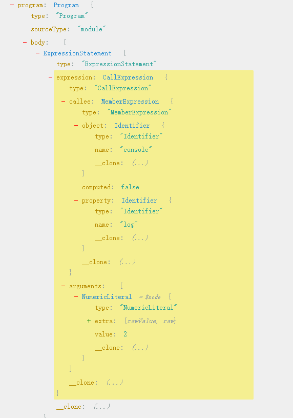

# Babel Execrise

记录下根据《Babel 插件通关秘籍》掘金小册的学习过程。

涉及到的所有代码均可在[Github](https://github.com/1360151219/babel-exercise)中找到。

以下有些练习和知识点在这里[学习知识点笔记](http://www.strk2.cn/views/frontend/Compiler/Babel-execrise.html)

## 案例一：添加自定义代码参数

### 基本需求及解决思路

需求描述：我们经常会打印一些日志来辅助调试，但是有的时候会不知道日志是在哪个地方打印的。希望通过 babel 能够自动在 `console.log` 等 api 中插入文件名和行列号的参数，方便定位到代码。

我们通过[astexplorer.net](https://astexplorer.net/)来查看一下`console.log(2)`的一个 ast 结构：



从结构可以分析，我们只需要通过匹配`CallExpression`中的`MemberExpression`，判断是否是我们指定的 api，如果是，我们就可以在`CallExpression.arguments`中插入我们想要的信息。

代码的行列号参数在`CallExpression.loc`中。

### 涉及的 api

基本架构：

```js
const parser = require("@babel/parser");
const traverse = require("@babel/traverse").default;
const generate = require("@babel/generator").default;
const types = require("@babel/types");

const ast = parser.parse(sourceCode, {
  // parser 需要指定代码是不是包含 import、export 等，需要设置 moduleType 为 module 或者 script，我们干脆设置为 unambiguous，让它根据内容是否包含 import、export 来自动设置 moduleType。
  sourceType: "unambiguous",
  plugins: ["jsx"], // 设置插件
});

traverse(ast, {
  CallExpression(path, state) {},
});

const { code, map } = generate(ast);
console.log(code);
```

- `path.get().toString()` 获取其中具体 ast 的代码
- `generator(ast).code` 与上效果一样
- `path.insertBefore ` 插入 ast
- `path.replaceWith()`代替节点
- `path.findParent()`找到当前 path 的父节点
- `path.isJSXElement()`
- `path.skip()`跳过当前节点子节点的遍历

## 案例二：对 acorn 进行 ast 节点拓展

### 思路分析

首先要创建新的分词（token），即让 parser 知道你的新关键词。

然后要重新 acorn Parser 中的 keywords 属性

分词弄好后，要进行语法分析，acorn 对不同类型的节点都会调用`parseXxx`方法，我们重写`parseStatement`方法，组装新的 ast 节点

### 涉及到 API

- `Parser.acorn.keywordTypes`:Parser 的一个关键词 token 数组
- `Parser.startNode()`：创建一个空 ast 节点

```js
var Node = function Node(parser, pos, loc) {
  this.type = "";
  this.start = pos;
  this.end = 0;
  if (parser.options.locations) {
    this.loc = new SourceLocation(parser, loc);
  }
  if (parser.options.directSourceFile) {
    this.sourceFile = parser.options.directSourceFile;
  }
  if (parser.options.ranges) {
    this.range = [pos, 0];
  }
};
```

- `Parser.next()`: 消费当前 token，生成 AST，继续向下一个 token

- `Parser.finishNode()`：结束当前节点

```js
function finishNodeAt(node, type, pos, loc) {
  node.type = type;
  node.end = pos;
  if (this.options.locations) {
    node.loc.end = loc;
  }
  if (this.options.ranges) {
    node.range[1] = pos;
  }
  return node;
}

pp$2.finishNode = function (node, type) {
  return finishNodeAt.call(
    this,
    node,
    type,
    this.lastTokEnd,
    this.lastTokEndLoc
  );
};
```

## 练习一：@babel/code-frame 的使用和大概原理

## 练习二：babel-plugin-tester 的使用

## 练习三：@babel/preset-env 配置

## 案例三：函数自动埋点插桩

### 思路分析

首先判断有没有引入过目标文件，没有则通过 `@babel/helper-module-imports` 引入，并且记录下唯一 id 和生成好 AST

然后匹配到目标函数，插入即可。（注意对特殊函数做特殊处理）

**额外思考**

通过匹配函数中的`leadingComments`来进行决定是否插入埋点

## 案例四：自动转换国际化--i18n

### 主要思路

首先引入 i18n 模块，遍历处理`TemplateLiteral|StringLiteral`，转换成对应的`i18n.t(value)`节点，并且同时记录下原字符串，生成对应的语言文件。

## 案例五：根据注释或者 ts 类型自动生成 api 文档

> 这里我是基于 typescript 的实现

- `doctrine`:将注释转换成 AST 格式。（作者不再维护）
- `path.getTypeAnnotation()`：等同于`path.get('typeAnnotation').node`

完善了一下 AST 解析的情况：

- 支持更多的类型解析
- 加入了`interface`以及泛型的解析
- 对象字面量的解析

## 案例六：Linter

`path.buildCodeFrameError(msg,Error)`：构造一个 code frame，标记出当前 path 的位置
